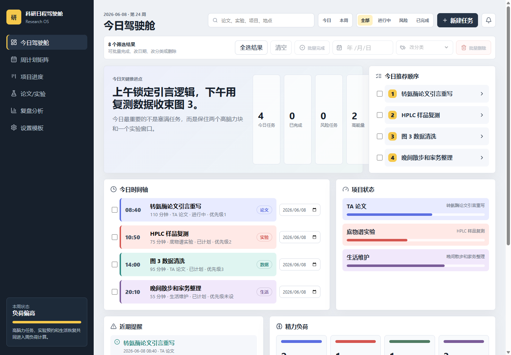

# 科研日程驾驶舱

面向个人科研工作的日程计划可视化工具。它把论文写作、实验、数据分析、学习和生活恢复放在同一个工作台里，帮助你安排每日任务、观察每周负载、追踪项目进度、复盘工作节奏，并把数据保存在本地浏览器。



## 当前能力

- 今日驾驶舱：今日推荐顺序、时间轴、项目状态、近期提醒、精力负荷和时间块。
- 周计划矩阵：按日期和任务类型查看任务分布、每日负载和超载提醒。
- 项目追踪：项目阶段、状态、里程碑、截止日期、进度趋势、风险提示和项目任务。
- 任务管理：新增、编辑、复制、删除、状态流转、实际耗时、优先级、备注、延期/阻塞原因和批量操作。
- 复盘洞察：完成率、延期率、阻塞统计、分类/项目投入、高脑力分布、风险洞察和手写复盘。
- 自定义设置：分类、项目、字段模板、首页模块、复盘指标、视图预设和显示密度。
- 数据安全：localStorage fallback 自动保存、本地数据文件夹模式、JSON 导入导出、CSV 导出、Markdown 周报、手动备份、硬盘备份和恢复前预览。

## 使用说明

1. 打开应用后先在顶部搜索框筛选任务；`Ctrl/Cmd + K` 可快速聚焦搜索。
2. 在今日页勾选任务后，可批量完成、改日期、改分类或删除。
3. 点击任务卡片查看详情，可编辑、复制、完成、恢复、延期、取消或删除。
4. 在项目页查看项目线，也可以从项目快速创建任务。
5. 在复盘页记录每日复盘、本周结论和下周调整。
6. 在设置页维护分类、项目、字段模板、视图预设和显示密度。

## 数据存储与备份

应用默认把数据保存在当前浏览器的 `localStorage` 中，不会自动上传到服务器。设置页还支持“本地数据文件夹”模式，用浏览器 File System Access API 在你选择的文件夹里读写数据。

- 推荐优先选择 `T:\日程驾驶舱数据\` 作为数据文件夹；如果没有 T 盘，可在浏览器弹窗里选择其他文件夹。
- 连接文件夹后会写入 `schedule-data.json`。
- 点击“创建备份”会写入 `backups/schedule-data-YYYY-MM-DD-HH-mm-ss.json`。
- 修改任务、项目、复盘和设置时仍会写入浏览器缓存；连接本地文件夹后会 debounce 自动保存到硬盘。
- 如果文件夹里已有 `schedule-data.json`，可点击“从硬盘读取”；如果没有，首次连接会把当前浏览器数据写入硬盘。
- 建议定期在设置页导出 JSON 备份。
- JSON 可完整恢复任务、分类、项目、模板、视图配置和复盘笔记。
- CSV 适合归档任务明细。
- Markdown 周报适合写周总结或同步给导师/合作者。
- 每次覆盖保存前会保留上一份自动备份快照。

## 本地开发

安装依赖：

```bash
npm install
```

启动开发服务器：

```bash
npm run dev -- --host 127.0.0.1 --port 5173
```

本机如果 npm shim 不可用，可使用：

```bash
node "D:\Download\Node\node_modules\npm\bin\npm-cli.js" run dev -- --host 127.0.0.1 --port 5173
```

## 验证命令

```bash
npm run test:run
npm run build
```

本机备用构建命令：

```bash
node "D:\Download\Node\node_modules\npm\bin\npm-cli.js" run build
```

## 部署

仓库包含 GitHub Pages workflow。推送到 `main` 后，工作流会运行测试、构建并上传 `dist/`。更多排障细节见 [docs/DEPLOYMENT.md](./docs/DEPLOYMENT.md)。

首次使用 GitHub Pages 时，需要在仓库设置中把 Pages source 设为 **GitHub Actions**。

部署地址预计为：

```text
https://he-lab2024.github.io/schedule-visualization-app/
```

## 隐私

详见 [PRIVACY.md](./PRIVACY.md)。简要来说：应用数据默认只存储在本地浏览器，导出的备份文件由你自己保存和管理。
